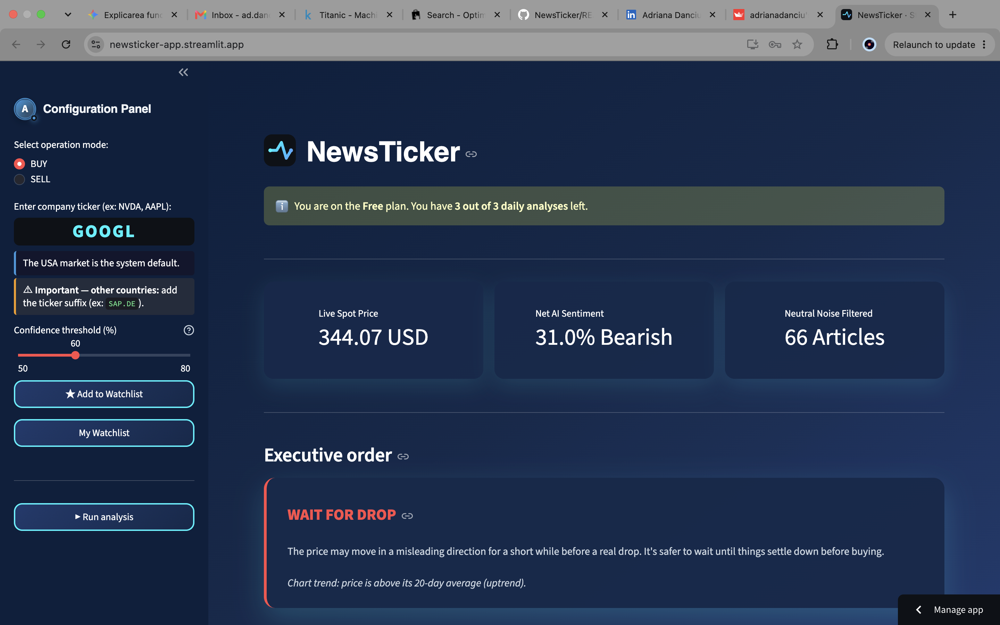

# NewsTicker
AI-powered financial news sentiment analysis, built in Python and Streamlit.
**Live demo:** [NewsTicker](https://newsticker-app.streamlit.app/)

## About
Inspired by my interest in finance, I built this app to complement existing trading-prediction tools. A problem I noticed across most of them is that they rely purely on chart-based math, great at that, but missing the news and information that actually move the market. NewsTicker brings both together: it scans live financial news headlines for a ticker you choose, runs AI sentiment analysis on them using FinBERT (a model trained specifically on financial text), cross-checks that sentiment against recent price trends, and gives a single, clear read on the market, instead of having to scroll through dozens of articles yourself.
## Features
- Multi-market support across 25+ countries, with localized news sourcing and currency formatting
- FinBERT-based sentiment scoring, blended with rule-based catalyst detection
- Live price and technical trend analysis
- Full authentication system with Free / Premium tiers
- PayPal payment integration for subscription upgrades
- Personal watchlist and analysis history, persisted per user
## Tech stack
Python, Streamlit, PyTorch, Hugging Face Transformers, PostgreSQL, PayPal API, BeautifulSoup
## Project structure
- `app.py` — Main file
- `auth.py` — Login, registration, and session logic 
- `db.py` — Database layer, with a pooled connection for concurrent users
- `theme.py` — All custom CSS/UI styling
- `sidebar.py` — Profile card, upgrade page, and configuration panel
- `engine.py` — Core decision logic
- `results.py` — Metrics, price chart, news table, and the analysis pipeline
- `ai.py` — FinBERT sentiment analysis
- `data.py` — News fetching
- `price.py` — Live price fetching
- `payments.py` — PayPal payment integration
- `legal.py` — Terms of Service, Privacy Policy, and Refund Policy pages
- `faq.py` — Frequently Asked Questions page
## How to run it locally
1. Install dependencies:
   ```bash
   pip install -r requirements.txt
   ```
2. Create `.streamlit/secrets.toml` with your own values:
   ```toml
   DB_URL = "your-supabase-postgres-connection-string"
   COOKIE_KEY = "any-long-random-string"
   COOKIE_NAME = "auth_cookie"
   PAYPAL_CLIENT_ID = "your-paypal-client-id"
   PAYPAL_CLIENT_SECRET = "your-paypal-client-secret"
   APP_BASE_URL = "http://localhost:8501"
   ```
3. Run the app:
   ```bash
   streamlit run app.py
   ```
   Then open the URL shown in the terminal (usually `http://localhost:8501`).